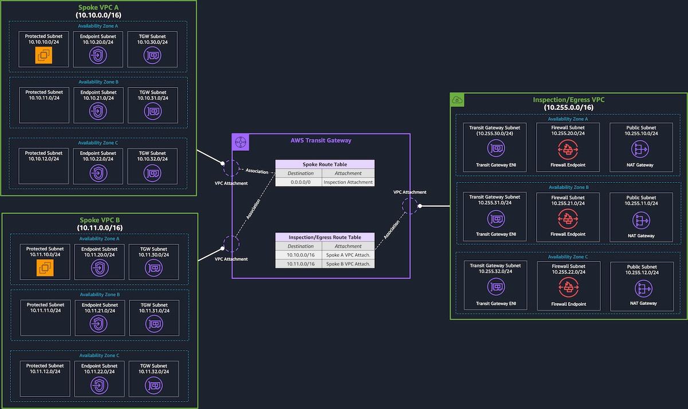

# AWS Network Firewall - Terraform Sample

This repository contains terraform code to deploy a sample architecture to try AWS Network Firewall. The resources deployed and the architectural pattern they follow is purely for demonstration/testing purposes. If you are looking for a set of approved architectures, read this [blog post](https://aws.amazon.com/blogs/networking-and-content-delivery/deployment-models-for-aws-network-firewall/).

The image below is a graphical representation of what resources are defined in the Terraform code in this repository: 

The templates deploy three VPCs (`spoke-a`, `spoke-b`, and `inspection`).
AWS Network Firewall endpoints are deployed in the Inspection VPC. 
Internet egress is also configured in the inspection VPC, by deploying NAT Gateways in Public Subnets.

The template deploys two EC2 instances in `spoke-vpc-a` and `spoke-vpc-b` for testing purposes. 
It also deploys resources so that connecting to these instances is enabled via [AWS Systems Manager Session Manager](https://docs.aws.amazon.com/systems-manager/latest/userguide/session-manager.html).

### AWS Network Firewall Configuration

The [firewall.tf](firewall.tf) template file contains the definitions of the FW rule-groups that these templates come with by default. 

The [default action](https://docs.aws.amazon.com/network-firewall/latest/developerguide/stateless-default-actions.html) taken by the stateless engine is `Forward to stateful rule groups`.

[Flow and log alerts](https://docs.aws.amazon.com/network-firewall/latest/developerguide/logging-cw-logs.html) are stored in separate Cloudwatch Log Groups 

The rule-groups configured in the policy are the following:
- `drop-icmp`: this is a stateless rule group that drops all ICMP traffic
- `drop-non-http-between-vpcs`: this stateful rules drops anything but HTTP traffic between spoke VPCs.
- `block-domains`: this stateful rule prevents any HTTP traffic to occur to two FQDNs specified in the rule itself.

The template deploys two instances in `spoke-vpc-a` and `spoke-vpc-b` in the `protected` subnets that you can use to test east-west connectivity (and north-south).

By default, the templates deploy in the `eu-west-1` AWS Region. 
If you wish to deploy in any other AWS Region, edit the corresponding setting in the [provider.tf](provider.tf) file.

### How-to
1. Install Terraform (0.14.6 or higher)
2. Clone this repository
3. Initialise Terraform `terraform init`
4. Deploy the template with `terraform apply`. 

## Security

See [CONTRIBUTING](CONTRIBUTING.md#security-issue-notifications) for more information.

## License

This library is licensed under the MIT-0 License. See the [LICENSE](LICENSE) file.

